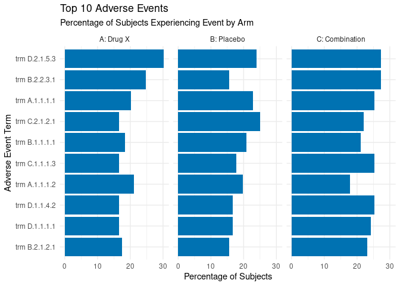
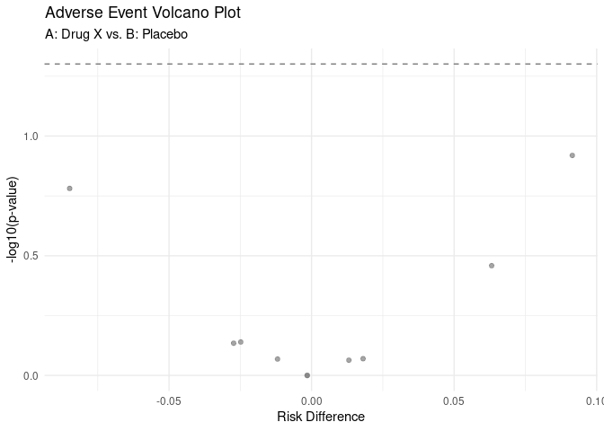

<!-- README.md is generated from README.Rmd. Please edit that file -->

# safeRview 📦

<!-- badges: start -->
<!-- badges: end -->

> An R package for summarizing and visualizing clinical trial adverse
> event (AE) data.

**Note:** This package is a portfolio project built to demonstrate core
skills in R package development, data visualization, and statistical
analysis within a pharmaceutical context. It is the foundation for an
interactive Shiny dashboard.

------------------------------------------------------------------------

## Installation

You can install the development version of safeRview from
[GitHub](https://github.com/rodb76/safeRview) with:

``` r
# install.packages("devtools")
devtools::install_github("rodb76/safeRview")
```

------------------------------------------------------------------------

## Example Usage

This package contains all the functions needed to go from raw CDISC-like
data to publication-ready plots.

``` r

# 1. Load the example datasets built into the package
data(adsl)
data(adae)

# 2. Create the summary analysis table
ae_table <- summarize_ae_data(adsl, adae)

print(head(ae_table))
#> # A tibble: 6 × 8
#>   AETERM        `n_A: Drug X` `n_B: Placebo` `n_C: Combination` `pct_A: Drug X`
#>   <fct>                 <int>          <int>              <int>           <dbl>
#> 1 trm D.2.1.5.3            33             23                 26            30.3
#> 2 trm A.1.1.1.1            22             22                 24            20.2
#> 3 trm B.2.2.3.1            27             15                 26            24.8
#> 4 trm C.2.1.2.1            18             24                 21            16.5
#> 5 trm B.1.1.1.1            20             20                 20            18.3
#> 6 trm A.1.1.1.2            23             19                 17            21.1
#> # ℹ 3 more variables: `pct_B: Placebo` <dbl>, `pct_C: Combination` <dbl>,
#> #   total_n <int>
```

# 3. Create a bar chart of the Top 10 AEs



# 4. Create a volcano plot comparing two arms



------------------------------------------------------------------------

## Core Components

This package demonstrates several key software development practices:

- **`data-raw/DATA.R`**: The script used to generate and process the
  `adsl.rda` and `adae.rda` example datasets.
- **`R/`**: Contains all core functions, separated by concern:
  - `summarize_ae.R`: Holds the `tidyverse`-based analysis function
    (`summarize_ae_data`).
  - `plot_ae.R`: Holds the `ggplot2` visualization functions
    (`plot_ae_barchart`, `plot_ae_volcano`).
- **Documentation**: All functions are documented using `roxygen2`,
  which generates the package `NAMESPACE` and help files (`.Rd`).
- **Testing**: The package includes a full suite of unit tests in the
  `tests/testthat/` directory to validate the analysis and plotting
  functions. You can run these locally with `devtools::test()`.

------------------------------------------------------------------------

## Next Steps: Shiny Dashboard

The next phase of this project is to build an interactive Shiny
application that uses this package as its analytical engine. This will
demonstrate skills in:

- Shiny UI/Server development
- Reactive programming
- Interactive plotting with `plotly`
- Application deployment on `shinyapps.io`
